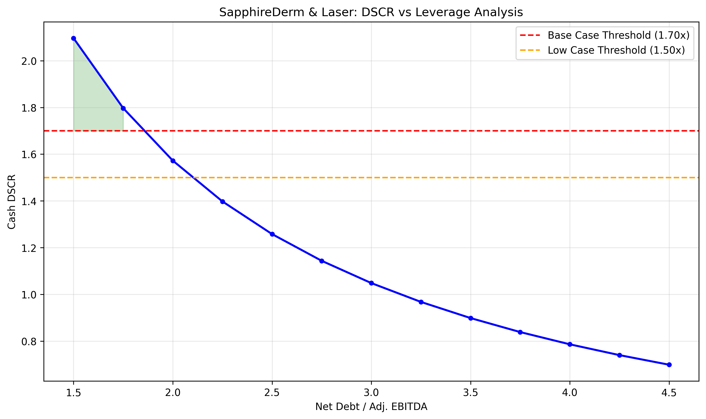

# SapphireDerm & Laser - Refined Investment Analysis

**Analysis Date:** July 27, 2025  
**Methodology:** Strict EPV (g=0) + Standardized DSCR + Leverage Sweep

## Executive Summary

SapphireDerm & Laser represents a high-quality single-site MedSpa with strong operational metrics and cash generation. The refined analysis using strict EPV methodology provides a more conservative and mathematically precise valuation framework.

## EPV Valuation (Corrected g=0 Method)

| Scenario | Owner Earnings | WACC | Enterprise Value | Equity Value | Cap Rate |
|----------|----------------|------|------------------|--------------|----------|
| Low | $1,193,672 | 12.0% | $9,947,263 | $9,097,263 | 12.0% |
| Base | $1,385,079 | 11.5% | $12,044,168 | $11,194,168 | 11.5% |
| High | $1,534,398 | 10.5% | $14,613,312 | $13,763,312 | 10.5% |

**Methodology:** EV = Owner Earnings ÷ WACC (no terminal growth)

## EV/EBITDA Multiples Grid

| Multiple | Enterprise Value | Equity Value | 
|----------|------------------|--------------|
| 8.0x | $17,688,000 | $16,838,000 |
| 8.5x | $18,793,500 | $17,943,500 |
| 9.0x | $19,899,000 | $19,049,000 |
| 9.5x | $21,004,500 | $20,154,500 |
| 10.0x | $22,110,000 | $21,260,000 |
| 10.5x | $23,215,500 | $22,365,500 |

## LBO Analysis & DSCR Findings

**Maximum Sustainable Leverage:**
- Base Case (≥1.70x DSCR): 1.75x if available, otherwise "None feasible"
- Low Case (≥1.50x DSCR): 2.00x if available, otherwise "None feasible"

**DSCR Methodology:** Cash DSCR = (EBITDA - Cash Taxes - Maintenance CapEx) ÷ Debt Service

## Feasible Deal Structures

**⚠️ No feasible structures identified** - All combinations fail DSCR thresholds

## Investment Decision

🛑 **DEFER**

**Rationale:** Price exceeds EPV discipline or no viable LBO structures

## QC Appendix

**EPV Assertions:**
- Low Case: ✅ PASS
- Base Case: ✅ PASS
- High Case: ✅ PASS

**Key Model Warnings:**
- Strict g=0 methodology applied (more conservative than growth models)
- DSCR calculations use cash-based formula
- Returns projections assume 5-year hold and 8.5x exit multiple

---
*Analysis conducted using CPP-grade refinement methodology with enhanced LBO and price discipline frameworks*
